# StockPicker Crew

An intelligent multi-agent AI system for stock analysis and investment recommendations, powered by [crewAI](https://crewai.com). This project uses collaborative AI agents to analyze trending companies, conduct financial research, and provide investment recommendations based on the latest market news and data.
    

## Features

- **Multi-Agent Analysis**: Three specialized AI agents work together to provide comprehensive stock analysis
- **Real-Time News Monitoring**: Automatically finds trending companies based on latest financial news
- **Comprehensive Research**: Conducts detailed financial analysis of identified companies
- **Investment Recommendations**: Provides data-driven stock picking decisions with detailed rationale
- **Automated Reporting**: Generates structured reports in JSON and Markdown formats

## How It Works

```mermaid
graph TD
    A[📰 Financial News Analyst] --> B[🔍 Senior Financial Researcher]
    B --> C[📊 Stock Picker]
    
    A --> D[Trending Companies<br/>JSON Output]
    B --> E[Research Report<br/>JSON Output]
    C --> F[Investment Decision<br/>Markdown Report]
    
    G[📈 Market News] --> A
    H[💰 Financial Data] --> B
    I[📋 Analysis Results] --> C
    
    style A fill:#000000
    style B fill:#000000
    style C fill:#000000
    style D fill:#000000
    style E fill:#000000
    style F fill:#000000
```



### Agent Workflow

The StockPicker Crew consists of three specialized agents working in sequence:

1. **📰 Financial News Analyst** - Scans latest news to identify 2-3 trending companies in a specified sector
2. **🔍 Senior Financial Researcher** - Conducts comprehensive analysis of the trending companies  
3. **📊 Stock Picker** - Analyzes research findings and selects the best investment opportunity

## Quick Start

```mermaid
graph LR
    A[🐍 Install Python 3.10+] --> B[📦 Install UV]
    B --> C[⚙️ Install Dependencies]
    C --> D[🔑 Add API Keys]
    D --> E[🚀 Run Analysis]
    
    style A fill:#00000
    style B fill:#000000
    style C fill:#000000
    style D fill:#000000
    style E fill:#000000
```



## Installation

Ensure you have Python >=3.10 <3.14 installed on your system. This project uses [UV](https://docs.astral.sh/uv/) for dependency management.

1. **Install UV** (if not already installed):
```bash
pip install uv
```

2. **Install Dependencies**:
```bash
crewai install
```

3. **Configure API Keys** - Add your API keys to the `.env` file:
```bash
# Required for Gemini LLM
GOOGLE_API_KEY=your_gemini_api_key_here
SERPER_API_KEY=your_api_key_here

# Optional: Add other API keys as needed
OPENAI_API_KEY=your_openai_api_key_here
```

## Configuration

- **Agents**: Modify `src/stock_picker/config/agents.yaml` to customize agent roles and capabilities
- **Tasks**: Modify `src/stock_picker/config/tasks.yaml` to define analysis workflows
- **Sector Focus**: Change the target sector in `src/stock_picker/main.py` (default: "AI and Machine Learning")
- **Custom Tools**: Add specialized tools in `src/stock_picker/tools/`

## Running the Project

To start the stock analysis process, run from the root folder:

```bash
crewai run
```

Or run directly with Python:
```bash
python -m stock_picker.main
```

The system will:
1. Search for trending companies in the AI and Machine Learning sector
2. Conduct detailed financial research on identified companies
3. Select the best investment opportunity
4. Generate comprehensive reports in the `output/` directory

## Output Files

The analysis generates several output files:

- `output/trending_companies.json` - List of trending companies found in the news
- `output/research_report.json` - Detailed financial analysis of each company
- `output/decision.md` - Final investment recommendation with rationale

## Customization

### Changing the Target Sector
Edit `src/stock_picker/main.py` to analyze different sectors:
```python
inputs = {
    'sector': 'Healthcare Technology'  # Change this to your preferred sector
}
```

### Adding Custom Tools
Create new tools in `src/stock_picker/tools/` to extend agent capabilities:
- Financial data APIs
- Technical analysis tools
- Risk assessment modules
- Portfolio optimization tools

### Agent Configuration
Each agent can be customized in `src/stock_picker/config/agents.yaml`:
- Change LLM models (currently using Gemini 1.5 Flash)
- Modify agent roles and goals
- Add specialized tools and capabilities

## Available Commands

- `crewai run` - Execute the full stock analysis workflow
## Project Structure

```
📁 stock_picker/
├── 📁 src/stock_picker/           # Main application code
│   ├── 📁 config/                 # Configuration files
│   │   ├── 📄 agents.yaml         # Agent definitions and roles
│   │   └── 📄 tasks.yaml          # Task workflows and dependencies
│   ├── 📁 tools/                  # Custom tools for agents
│   │   ├── 📄 custom_tool.py      # Specialized analysis tools
│   │   └── 📄 __init__.py
│   ├── 📄 crew.py                 # Main crew orchestration
│   ├── 📄 main.py                 # Entry point
│   └── 📄 __init__.py
├── 📁 output/                     # Generated reports and analysis
│   ├── 📄 trending_companies.json # Found trending companies
│   ├── 📄 research_report.json    # Detailed financial analysis
│   └── 📄 decision.md             # Final investment recommendation
├── 📁 tests/                      # Test files
├── 📄 .env                        # API keys and environment variables
├── 📄 pyproject.toml              # Project dependencies and metadata
└── 📄 README.md                   # This file
```

## Requirements

- Python >=3.10, <3.14
- UV package manager
- Gemini API key (for LLM functionality)
- Internet connection (for news and financial data)

## Troubleshooting

**API Key Issues**: Ensure your `GOOGLE_API_KEY` is properly set in the `.env` file
**API Cost Is More** :Ensure the cost


---

Let's create wonders together with the power and simplicity of crewAI.
